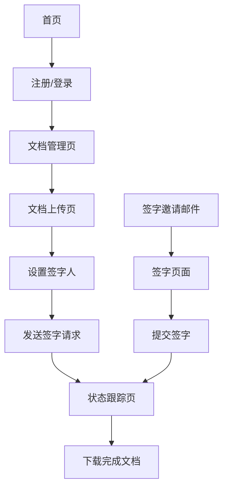

## 1. 产品概述
HHSign是一个在线PDF文档分发和签字管理平台，允许用户上传PDF文档，分发给多个收件人进行在线签字，并实时跟踪签字状态。该平台解决了传统纸质文档签字的效率低下问题，为企业和个人提供便捷的电子签字解决方案。

目标用户包括需要收集多方签字的企业、法律机构、人力资源部门以及任何需要远程签字确认的个人用户。通过HHSign，用户可以大幅缩短文档签字周期，提高工作效率。

## 2. 核心功能

### 2.1 用户角色
| 角色 | 注册方式 | 核心权限 |
|------|----------|----------|
| 文档发起人 | 邮箱注册 | 上传PDF、添加签字人、发送签字请求、查看签字状态 |
| 签字人 | 邮箱邀请 | 查看文档、在线签字、提交签字 |
| 阅览者 | 邮箱邀请 | 仅查看文档、接收完成通知、不参与签字 |
| 管理员 | 内部创建 | 管理用户、查看统计数据、系统设置 |

### 2.2 功能模块
HHSign包含以下核心页面：
1. **首页**：功能介绍、登录注册入口、价格方案
2. **文档管理页**：文档列表、上传新文档、查看签字进度
3. **文档上传页**：PDF上传、签字区域设置、签字人信息填写
4. **签字页面**：文档预览、签字工具、提交签字
5. **状态跟踪页**：签字状态列表、发送提醒、下载已完成文档
6. **用户中心**：个人信息、已发送文档、已接收签字请求

### 2.3 页面详情
| 页面名称 | 模块名称 | 功能描述 |
|----------|----------|----------|
| 首页 | 导航栏 | 显示logo、登录/注册按钮、语言切换 |
| 首页 | 功能介绍 | 轮播图展示产品核心功能、特点说明 |
| 首页 | 价格方案 | 展示免费版、专业版、企业版功能对比 |
| 文档管理页 | 文档列表 | 显示所有上传文档、状态筛选、搜索功能 |
| 文档管理页 | 上传按钮 | 点击跳转到文档上传页面 |
| 文档上传页 | PDF上传 | 拖拽或选择PDF文件、文件大小验证33. | 文档上传页 | 签字区域设置 | 在PDF页面上标记签字位置、设置签字顺序 |
34. | 文档上传页 | 签字人信息 | 添加多个签字人邮箱、姓名 |
35. | 文档上传页 | 邮件设置 | 录入邮件主题、内容，选择通知语言（中/英/泰） |
36. | 签字页面 | 文档预览 | 显示PDF文档、支持缩放、翻页 |
| 签字页面 | 签字工具 | 提供手写签字、上传签字图片、输入姓名签字 |
| 签字页面 | 提交签字 | 确认签字信息、提交到服务器 |
| 状态跟踪页 | 进度列表 | 显示每个签字人的签字状态、时间戳 |
| 状态跟踪页 | 提醒功能 | 向未签字人发送邮件提醒 |
| 状态跟踪页 | 下载功能 | 下载已完成签字的PDF文档 |
| 用户中心 | 个人信息 | 显示用户名、邮箱、账户类型 |
| 用户中心 | 文档统计 | 显示已发送文档数、已完成签字数 |

## 3. 核心流程

### 文档发起人流程
1. 用户注册/登录系统
2. 上传PDF文档到平台
3. 在文档上标记签字区域
4. 录入邮件主题和内容，并选择签字人通知语言（中文、英语、泰语）
5. 添加多个签字人信息（姓名、邮箱）
   - *注：系统会自动添加3位固定阅览者（feihuo0804@gmail.com, hhfamily2222@gmail.com, rockethuo0404@gmail.com），无需手动输入，且默认接收英语通知*
6. 设置签字截止日期和提醒频率
7. 发送邀请邮件给所有关联人
   - 签字人收到指定语言的邮件
   - 固定阅览者收到英语邮件
7. 在状态跟踪页查看签字进度
8. 所有签字完成后，系统自动将最终文档分发给所有关联人（发起人、签字人、阅览者）
9. 发起人可随时下载最终文档

### 签字人/阅览者流程
1. 收到邀请邮件
2. 点击邮件中的链接访问文档页面
3. 查看文档内容
4. 根据角色执行操作：
   - **签字人**：在指定位置进行签字（手写、上传图片或输入姓名），确认并提交
   - **阅览者**：仅阅览文档内容，无需操作
5. 签字人提交后收到确认邮件
6. 所有流程结束后，收到包含最终文档的完成邮件

## 4. 用户界面设计

### 4.1 设计风格
- **主色调**：深蓝色（#2563eb）代表专业可信，辅以白色背景
- **按钮样式**：圆角矩形设计，主要按钮使用主色调，次要按钮使用灰色
- **字体**：中文使用思源黑体，英文使用Inter，正文字号14-16px
- **布局风格**：卡片式布局，顶部固定导航栏，内容区域居中显示
- **图标风格**：使用简洁的线性图标，统一使用Feather Icons图标库

### 4.2 页面设计概览
| 页面名称 | 模块名称 | UI元素 |
|----------|----------|----------|
| 首页 | 导航栏 | 白色背景、logo居左、登录按钮居右、固定顶部 |
| 首页 | 功能介绍 | 全屏轮播、渐变背景、大标题、功能图标卡片 |
| 文档管理页 | 文档列表 | 卡片网格布局、状态标签（待签字、进行中、已完成）、进度条 |
93. | 文档上传页 | PDF预览 | 左侧PDF预览区域、右侧设置面板、拖拽上传区域 |
94. | 文档上传页 | 邮件设置 | 邮件主题输入框、邮件内容文本域、语言选择下拉框（中/英/泰） |
95. | 签字页面 | 签字区域 | PDF文档居中、底部工具栏、签字弹窗 |
| 状态跟踪页 | 进度列表 | 时间线样式、用户头像、状态图标、操作按钮 |

### 4.3 响应式设计
- 采用桌面端优先设计，适配1920x1080标准分辨率
- 平板端（768px-1024px）采用自适应布局，调整卡片数量和间距
- 手机端（<768px）采用单列布局，隐藏非核心功能
- 触摸交互优化：增大按钮点击区域、支持手势操作

### 4.4 性能要求
- PDF加载时间不超过3秒
- 签字提交响应时间不超过1秒
- 支持同时处理100个并发用户
- 支持最大50MB的PDF文件上传