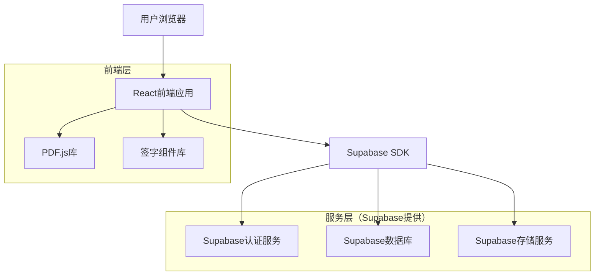
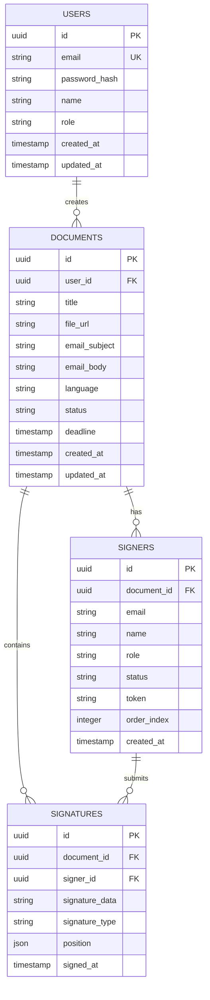

## 1. 架构设计



## 2. 技术描述

- **前端**：React@18 + TypeScript + Tailwind CSS@3 + Vite
- **初始化工具**：vite-init
- **UI组件库**：Ant Design@5
- **PDF处理**：PDF.js + pdf-lib
- **签字功能**：react-signature-canvas
- **后端**：Supabase（BaaS平台）
- **邮件服务**：Supabase内置邮件功能
- **文件存储**：Supabase Storage

## 3. 路由定义

| 路由 | 用途 |
|-------|---------|
| / | 首页，产品展示和功能介绍 |
| /login | 登录页面，用户身份验证 |
| /register | 注册页面，新用户注册 |
| /dashboard | 文档管理页面，显示用户所有文档 |
| /upload | 文档上传页面，PDF上传和签字设置 |
| /document/:id | 文档详情页面，查看签字状态 |
| /sign/:token | 签字页面，签字人访问进行签字 |
| /profile | 用户中心，个人信息和设置 |
| /settings | 系统设置页面（管理员） |

## 4. 数据库模型

### 4.1 数据模型定义


### 4.2 数据定义语言

用户表（users）
```sql
-- 创建表
CREATE TABLE users (
  id UUID PRIMARY KEY DEFAULT gen_random_uuid(),
  email VARCHAR(255) UNIQUE NOT NULL,
  password_hash VARCHAR(255) NOT NULL,
  name VARCHAR(100) NOT NULL,
  role VARCHAR(20) DEFAULT 'user' CHECK (role IN ('user', 'admin')),
  created_at TIMESTAMP WITH TIME ZONE DEFAULT NOW(),
  updated_at TIMESTAMP WITH TIME ZONE DEFAULT NOW()
);

-- 创建索引
CREATE INDEX idx_users_email ON users(email);
CREATE INDEX idx_users_role ON users(role);
```

文档表（documents）
```sql
-- 创建表
CREATE TABLE documents (
  id UUID PRIMARY KEY DEFAULT gen_random_uuid(),
  user_id UUID NOT NULL REFERENCES users(id) ON DELETE CASCADE,
  title VARCHAR(255) NOT NULL,
  file_url TEXT NOT NULL,
  email_subject VARCHAR(255),
  email_body TEXT,
  language VARCHAR(10) DEFAULT 'en' CHECK (language IN ('zh', 'en', 'th')),
  status VARCHAR(20) DEFAULT 'pending' CHECK (status IN ('pending', 'in_progress', 'completed', 'expired')),
  deadline TIMESTAMP WITH TIME ZONE,
  created_at TIMESTAMP WITH TIME ZONE DEFAULT NOW(),
  updated_at TIMESTAMP WITH TIME ZONE DEFAULT NOW()
);

-- 创建索引
CREATE INDEX idx_documents_user_id ON documents(user_id);
CREATE INDEX idx_documents_status ON documents(status);
CREATE INDEX idx_documents_created_at ON documents(created_at DESC);
```

签字人表（signers）
```sql
-- 创建表
CREATE TABLE signers (
  id UUID PRIMARY KEY DEFAULT gen_random_uuid(),
  document_id UUID NOT NULL REFERENCES documents(id) ON DELETE CASCADE,
  email VARCHAR(255) NOT NULL,
  name VARCHAR(100) NOT NULL,
  role VARCHAR(20) DEFAULT 'signer' CHECK (role IN ('signer', 'viewer')),
  status VARCHAR(20) DEFAULT 'pending' CHECK (status IN ('pending', 'signed', 'declined')),
  token VARCHAR(255) UNIQUE NOT NULL,
  order_index INTEGER DEFAULT 0,
  created_at TIMESTAMP WITH TIME ZONE DEFAULT NOW()
);

-- 创建索引
CREATE INDEX idx_signers_document_id ON signers(document_id);
CREATE INDEX idx_signers_token ON signers(token);
CREATE INDEX idx_signers_email ON signers(email);
```

签字记录表（signatures）
```sql
-- 创建表
CREATE TABLE signatures (
  id UUID PRIMARY KEY DEFAULT gen_random_uuid(),
  document_id UUID NOT NULL REFERENCES documents(id) ON DELETE CASCADE,
  signer_id UUID NOT NULL REFERENCES signers(id) ON DELETE CASCADE,
  signature_data TEXT NOT NULL,
  signature_type VARCHAR(20) NOT NULL CHECK (signature_type IN ('draw', 'text', 'image')),
  position JSONB NOT NULL,
  signed_at TIMESTAMP WITH TIME ZONE DEFAULT NOW()
);

-- 创建索引
CREATE INDEX idx_signatures_document_id ON signatures(document_id);
CREATE INDEX idx_signatures_signer_id ON signatures(signer_id);
```

### 4.3 访问权限设置
```sql
-- 基本权限授予
GRANT SELECT ON users TO anon;
GRANT SELECT ON documents TO anon;
GRANT SELECT ON signers TO anon;
GRANT SELECT ON signatures TO anon;

-- 认证用户权限
GRANT ALL PRIVILEGES ON users TO authenticated;
GRANT ALL PRIVILEGES ON documents TO authenticated;
GRANT ALL PRIVILEGES ON signers TO authenticated;
GRANT ALL PRIVILEGES ON signatures TO authenticated;

-- 行级安全策略（RLS）
ALTER TABLE documents ENABLE ROW LEVEL SECURITY;
ALTER TABLE signers ENABLE ROW LEVEL SECURITY;
ALTER TABLE signatures ENABLE ROW LEVEL SECURITY;

-- 文档访问策略
CREATE POLICY "用户只能查看自己的文档" ON documents
  FOR ALL USING (auth.uid() = user_id);

CREATE POLICY "签字人可以通过token查看文档" ON documents
  FOR SELECT USING (
    EXISTS (
      SELECT 1 FROM signers 
      WHERE signers.document_id = documents.id 
      AND signers.token = auth.jwt() ->> 'token'
    )
  );
```

## 5. API接口定义

### 5.1 认证相关API
```
POST /api/auth/register
```
请求：
| 参数名 | 参数类型 | 是否必需 | 描述 |
|--------|----------|----------|------|
| email | string | 是 | 用户邮箱 |
| password | string | 是 | 密码（最少6位） |
| name | string | 是 | 用户姓名 |

响应：
```json
{
  "user": {
    "id": "uuid",
    "email": "user@example.com",
    "name": "用户名"
  },
  "session": {
    "access_token": "jwt_token",
    "refresh_token": "refresh_token"
  }
}
```

### 5.2 文档管理API
```
POST /api/documents/upload
```
请求：
| 参数名 | 参数类型 | 是否必需 | 描述 |
|--------|----------|----------|------|
| file | File | 是 | PDF文件 |
| title | string | 是 | 文档标题 |
| email_subject | string | 否 | 邮件主题 |
| email_body | string | 否 | 邮件内容 |
| language | string | 是 | 通知语言（zh/en/th） |
| deadline | string | 否 | 截止日期 |

响应：
```json
{
  "document": {
    "id": "uuid",
    "title": "文档标题",
    "file_url": "storage_url",
    "email_subject": "邮件主题",
    "language": "zh",
    "status": "pending"
  }
}
```

### 5.3 签字人管理API
```
POST /api/documents/:id/signers
```
请求：
| 参数名 | 参数类型 | 是否必需 | 描述 |
|--------|----------|----------|------|
| signers | array | 是 | 签字人列表 |
| signers[].email | string | 是 | 签字人邮箱 |
| signers[].name | string | 是 | 签字人姓名 |
| signers[].role | string | 否 | 角色（signer/viewer），默认signer |
| signers[].order_index | number | 是 | 签字顺序 |

响应：
```json
{
  "signers": [
    {
      "id": "uuid",
      "email": "signer@example.com",
      "name": "签字人姓名",
      "role": "signer",
      "token": "access_token",
      "status": "pending"
    }
  ]
}
```

### 5.4 签字提交API
```
POST /api/sign/:token
```
请求：
| 参数名 | 参数类型 | 是否必需 | 描述 |
|--------|----------|----------|------|
| signature_data | string | 是 | 签字数据（base64） |
| signature_type | string | 是 | 签字类型（draw/text/image） |
| position | object | 是 | 签字位置信息 |

响应：
```json
{
  "signature": {
    "id": "uuid",
    "document_id": "uuid",
    "signed_at": "2024-01-01T00:00:00Z"
  },
  "message": "签字提交成功"
}
```

## 6. 核心技术实现

### 6.1 PDF处理
- 使用PDF.js进行PDF文件的预览和渲染
- 使用pdf-lib库进行PDF的编辑和签字合成
- 支持最大50MB的PDF文件处理
- 实现分页加载，优化大文件性能

### 6.2 签字功能
- 提供三种签字方式：手写签字、文本签字、图片签字
- 使用canvas实现手写签字功能
- 支持签字位置的精确定位和拖拽调整
- 签字数据以base64格式存储

### 6.3 邮件通知
- 使用Supabase内置的邮件服务功能
- 支持签字邀请、签字提醒、签字完成通知
- **语言支持**：
  - 签字人通知：根据文档设置的语言（中/英/泰）发送
  - 阅览者通知：固定使用英语发送给预设的3位阅览者（feihuo0804@gmail.com等）
- **自动分发**：所有签字完成后，系统自动发送带有最终文档附件（或下载链接）的邮件给所有关联人（发起人、签字人、阅览者）
- 提供邮件发送状态跟踪

### 6.3.1 多语言邮件实现机制
邮件发送逻辑将在后端（Supabase Edge Functions）中实现，核心流程如下：

1.  **模板管理**：在Edge Function中维护多语言邮件模板对象。
    ```javascript
    const emailTemplates = {
      zh: {
        invite: { subject: "请签署文档：{{title}}", body: "您好 {{name}}，..." },
        complete: { subject: "文档签署完成", body: "..." }
      },
      en: {
        invite: { subject: "Please sign: {{title}}", body: "Hello {{name}}, ..." },
        complete: { subject: "Document Completed", body: "..." }
      },
      th: {
        invite: { subject: "กรุณาลงนาม: {{title}}", body: "สวัสดี {{name}}, ..." },
        complete: { subject: "เอกสารเสร็จสมบูรณ์", body: "..." }
      }
    };
    ```

2.  **语言判定逻辑**：
    在发送邮件时，根据收件人角色动态决定使用的语言代码：
    ```javascript
    const targetLang = recipient.role === 'viewer' ? 'en' : document.language;
    const template = emailTemplates[targetLang][actionType];
    ```

3.  **内容组装**：
    *   **系统预设内容**（如问候语、按钮文案）：直接从 `emailTemplates` 获取。
    *   **用户自定义内容**（如用户录入的邮件正文）：
        *   如果是签字人且语言匹配：将用户录入的 `email_body` 插入到模板中。
        *   如果是阅览者（强制英文）：使用系统默认的英文通知模板，或者如果用户录入的是英文则使用，否则使用通用英文通知。
    *   **变量替换**：替换 `{{name}}`, `{{link}}`, `{{title}}` 等占位符。

4.  **发送执行**：调用邮件发送API完成投递。

### 6.4 安全考虑
- 使用JWT token进行用户认证
- 签字链接使用一次性token，有效期7天
- 实施HTTPS加密传输
- 用户密码使用bcrypt加密存储
- 实施SQL注入防护和XSS防护